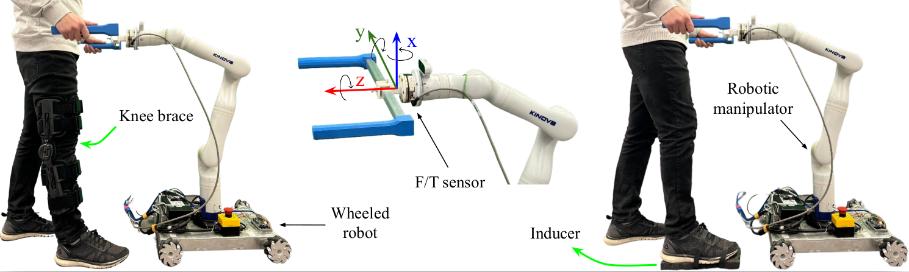
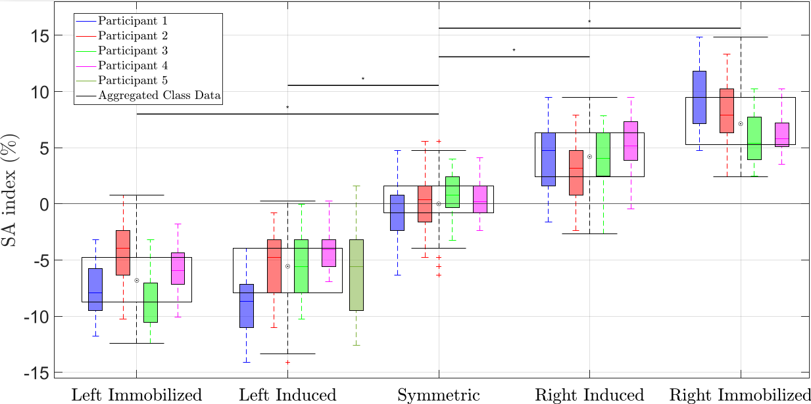
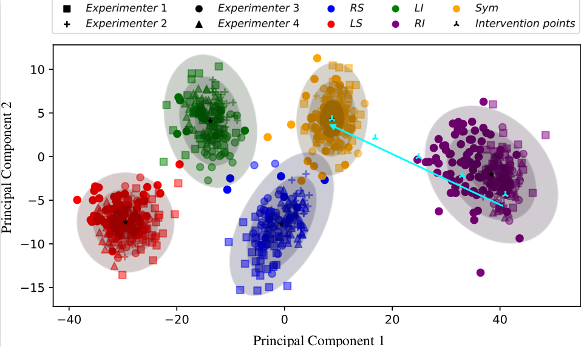

# Gait Symmetry Analysis with a Smart Walker

This repository contains the Python notebook and associated resources for analyzing gait symmetry using data collected from a Smart Robotic Walker. This project leverages advanced signal processing techniques, including **Multi-Seasonal-Trend Decomposition**, to evaluate and quantify gait symmetry based on human-robot interaction data.

## Publication

This repository is associated with our paper titled **"Evaluating Gait Symmetry with a Smart Robotic Walker: A Novel Approach to Mobility Assessment"**, presented at the **IROS 2024**. The study demonstrates the potential of using sensor-integrated smart walkers to detect, quantify, and classify gait asymmetries, offering a novel diagnostic and rehabilitation tool for patients with neurological or physical gait disorders.

---

## Project Overview

The smart walker records user interaction data during walking using an Axia80 force/torque sensor. The data includes:

- **Forward Force**
- **Downward Force**
- **Torque in the Z-Axis**  

Using this data, the project applies Multi-Seasonal-Trend Decomposition (MSTL) techniques to extract gait patterns, evaluate stride symmetry, and classify asymmetry severity.

  

---

## Features of the Analysis

- **Data Filtering:** Uses a **Butterworth low-pass filter** to remove noise from the torque data.
- **Stride Segmentation:** Identifies individual strides using peak detection and equalizes their lengths for consistency.
- **Seasonal-Trend Decomposition:** Decomposes the signal into:
  - **Trend Component**: Long-term variations, such as fatigue.
  - **Seasonal Component**: Gait periodicity and symmetry.
  - **Residual Component**: Noise and unmodeled data.
- **Symmetry Analysis:** Evaluates gait symmetry using the **Symmetry Angle (SA) index** to detect and quantify asymmetries.
- **Visualization:** Provides detailed plots of the filtered data, decomposed components, and stride comparison.

---

## Results

Key findings from the project include:
- **High Precision and Accuracy:** The proposed method achieved an overall accuracy of **84.9%** in detecting asymmetric gaits.
- **Robust Analysis:** Successfully classified asymmetry severity and provided insights for gait rehabilitation strategies.
- **Practical Applications:** Demonstrated the feasibility of using smart walkers as diagnostic and monitoring tools for mobility-impaired individuals.

  

---

## Code Highlights

The repository contains a **Google Colab notebook** that includes:
- Code to load and preprocess `.mat` data files.
- Functions for filtering, segmentation, and interpolation of stride data.
- Implementation of **MSTL (Multiple Seasonal-Trend Decomposition)** for gait analysis.
- Visualization tools for analyzing and comparing different walking patterns.

  

---

## Usage Instructions

1. **Data Preparation:**
   - Upload your `.mat` files to your Google Drive and update the file paths in the notebook.
2. **Run the Notebook:**
   - Execute each section step-by-step for filtering, segmentation, and decomposition.
3. **Visualize Results:**
   - Review the plots for detailed insights into gait symmetry and trends.

---

## Dependencies

The code is implemented in Python and uses the following libraries:
- `scipy`
- `numpy`
- `pandas`
- `statsmodels`
- `matplotlib`

---

## Citation

If you use this code or methodology in your research, please cite our paper:

**"Evaluating Gait Symmetry with a Smart Robotic Walker: A Novel Approach to Mobility Assessment"**  
*IEEE International Conference on Intelligent Robots and Systems (IROS), 2024.*  
DOI: [10.1109/IROS58592.2024.10801709](https://doi.org/10.1109/IROS58592.2024.10801709)

	'''bash
	@INPROCEEDINGS{10801709,
        author={Chalaki, Mahdi and Soleymani, Abed and Li, Xingyu and Mushahwar, Vivian and Tavakoli, Mahdi},
	booktitle={2024 IEEE/RSJ International Conference on Intelligent Robots and Systems (IROS)},
 	title={Evaluating Gait Symmetry with a Smart Robotic Walker: A Novel Approach to Mobility Assessment}, 
 	year={2024},
  	volume={},
	number={},
	pages={4686-4692},
  	keywords={Legged locomotion;Biomechanics;Torque;Estimation;Robot sensing systems;Torque measurement;Indexes;Monitoring;Intelligent robots;Testing},
  	doi={10.1109/IROS58592.2024.10801709}}
